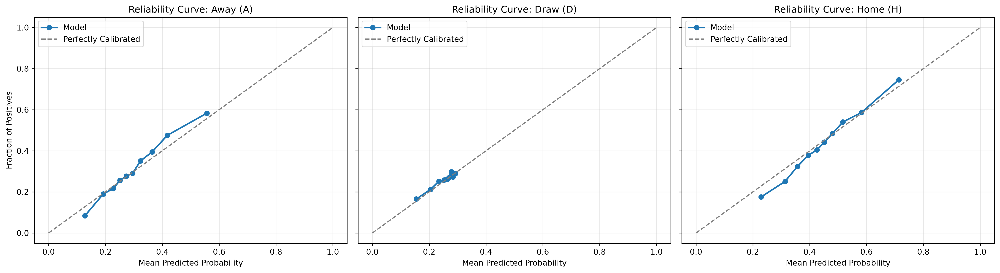

# FootballPredictor

A machine learning pipeline designed to predict match outcomes (1X2: Home Win, Draw, Away Win) exclusively across major domestic football leagues. Domestic leagues offer a consistent structural framework of round-robin fixtures and stable home-field dynamics, unlike knockout cup ties or international fixtures where squad rotations, travel distances, and single-leg tactics skew baseline variance. Rather than predicting discrete winners, the system prioritizes well-calibrated probabilistic forecasting to measure true match uncertainty—critical for handling high-variance outcomes like draws.

---

## Data

The dataset combines historical match logs and squad market values sourced from Transfermarkt (via Kaggle).

* **Temporal Splitting:** To ensure zero lookahead bias and reflect real-world deployment, data is strictly partitioned chronologically by unique match dates:
  * **Train Set:** Initial 70% of historical dates
  * **Validation Set:** Middle 15% of historical dates (used for early stopping & hyperparameter tuning)
  * **Test Set:** Final 15% of historical dates (held out for final evaluation)

---

## Approach

The pipeline relies on an **XGBoost** classifier (`multi:softprob` objective) trained with multi-class log loss.

* **Feature Engineering:**
  * **Elo Metrics:** Pre-match Elo ratings and rating differentials (`elo_diff`).
  * **Table Position:** Pre-match league positions for home and away clubs.
  * **Rolling Form (L7 Window):** Overall and venue-split (home/away) averages for goals scored, goals conceded, goal difference, points earned, and draw rates.
  * **Rest & Schedule:** Days of rest since the previous match for each team alongside the current season matchday.
* **Leakage Handling:** Features are engineered strictly using historical pre-match knowledge. Post-match metadata, fixture statistics, and future timestamps are stripped prior to model input.

---

## Results

### Model Performance Comparison on Test Set

| Model Version | Accuracy | Brier Score | Log Loss | AUC (Draw) | AUC (Home) | AUC (Away) |
| :--- | :---: | :---: | :---: | :---: | :---: | :---: |
| **Baseline (v1.0)** | 0.5120 | 0.6080 | 1.0160 | 0.5210 | 0.6840 | 0.6650 |
| **v2.0 (Form Splits)** | 0.5180 | 0.6070 | 1.0140 | 0.5280 | 0.6910 | 0.6720 |
| **v3.0 (Elo Integration)** | **0.5011** | **0.6047** | **1.0111** | **0.5488** | **0.6841** | **0.6823** |

*Note: While raw accuracy drops slightly on the test set for v3.0, probabilistic scoring metrics (Log Loss and Brier Score) improve over prior iterations due to better probability calibration.*

### Calibration & Reliability


*(Reliability plot generated at `reports/figures/reliability_curves.png` during evaluation).*

---

## Findings

* **Well-Calibrated Probabilities:** Output probabilities reflect empirical outcome frequencies across classes, ensuring model outputs work as true risk probabilities rather than raw uncalibrated scores.
* **Elo Dominance:** Elo-based features dominate model importance. Pre-match Elo difference (`elo_diff`) accounts for **26.76%** of total feature importance, followed by individual team Elo values (`away_club_elo_pre` at 9.17% and `home_club_elo_pre` at 90.3%).
* **Draw Dynamics:** The model never predicts a draw via raw `argmax` (0% recall across validation and test sets), as draw probabilities rarely cross the ~0.33 threshold in a multi-class setting. However, it assigns calibrated probability mass to draw risks, yielding a Draw ROC-AUC of **0.5488**.

---

## Limitations

* **Draw Resolution:** Predicting draws deterministically remains a core challenge due to the high variance and low individual probability mass assigned to draw occurrences in 1X2 markets.
* **Slight Draw Overfit:** Performance on draw distributions degrades slightly from validation (AUC 0.5667) to test (AUC 0.5488).
* **Test-Period Performance Drop:** Test accuracy drops to 50.11% relative to validation accuracy (53.65%). The exact driver—such as late-season tactical shifts, squad rotation, or unmodeled fatigue—remains unisolated.
* **Early Stopping Scope:** Early stopping conditions are driven by validation loss (`val_0-mlogloss`), introducing potential mild hyperparameter tuning leakage toward the validation split.

---

## How to Run

Run the end-to-end data preparation, feature engineering, model training, and evaluation pipeline with a single command:

```bash
python src/models/train.py